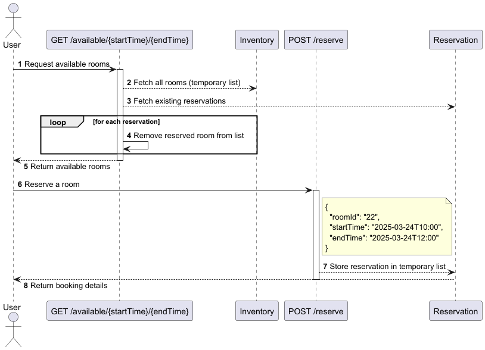

# Lab-1 - Conference Room Booking System

This project provides a simple API for checking conference room availability and making reservations. It's built with **Spring Boot** and follows a RESTful design.

---

## Overview

The system allows users to:

1. **Check available rooms** for a given time period.
2. **Reserve a room** within the available time.

---

## Components

- **User**: The client making API requests.
- **GET `/available/{startTime}/{endTime}`**: Endpoint to fetch available rooms.
- **POST `/reserve`**: Endpoint to make a reservation.
- **Inventory**: Manages the list of all rooms.
- **Reservation**: Stores existing reservations in a temporary in-memory list.

---

## Sequence Flow

### 1. Check Room Availability

**Endpoint**: `GET /available/{startTime}/{endTime}`  
**Process**:

- The user requests available rooms for a given time range.
- The system fetches all rooms from the **Inventory**.
- Then it fetches all existing reservations from **Reservation**.
- For each reservation, the system filters out already reserved rooms from the list.
- The remaining rooms are returned to the user as available.

### 2. Reserve a Room

**Endpoint**: `POST /reserve`  
**Payload**:

```json
{
  "roomId": "22",
  "startTime": "2025-03-24T10:00",
  "endTime": "2025-03-24T12:00"
}
```

**Process**:

- The user sends a reservation request with room ID and time range.
- The system stores the reservation in a temporary list in the **Reservation** component.
- The reservation details are returned to the user.

---

## Sequence Diagram


> The diagram above illustrates the end-to-end interaction between the user, API endpoints, and services.

### Notes

- This implementation uses a **temporary in-memory list** to manage rooms and reservations (not persisted).
- Ideal for demonstrating a reservation system flow or building a prototype.
- Can be extended to include database persistence, conflict resolution, authentication, etc.

---
## How to Run the Application

### Step 1: Build & Containerize

Use Maven to package and build the Docker image:

```bash
mvn clean install -P createimage
```

### Step 2: Run the Container

Launch the application using Docker:

```bash
docker run -p 8081:8081 manning/room-booking-system-jdk:1.0.0-SNAPSHOT
```

The service will be accessible at `http://localhost:8081`.

---

### Tech Stack
- Java 17
- Spring Boot 3.4.3
- Docker
---
